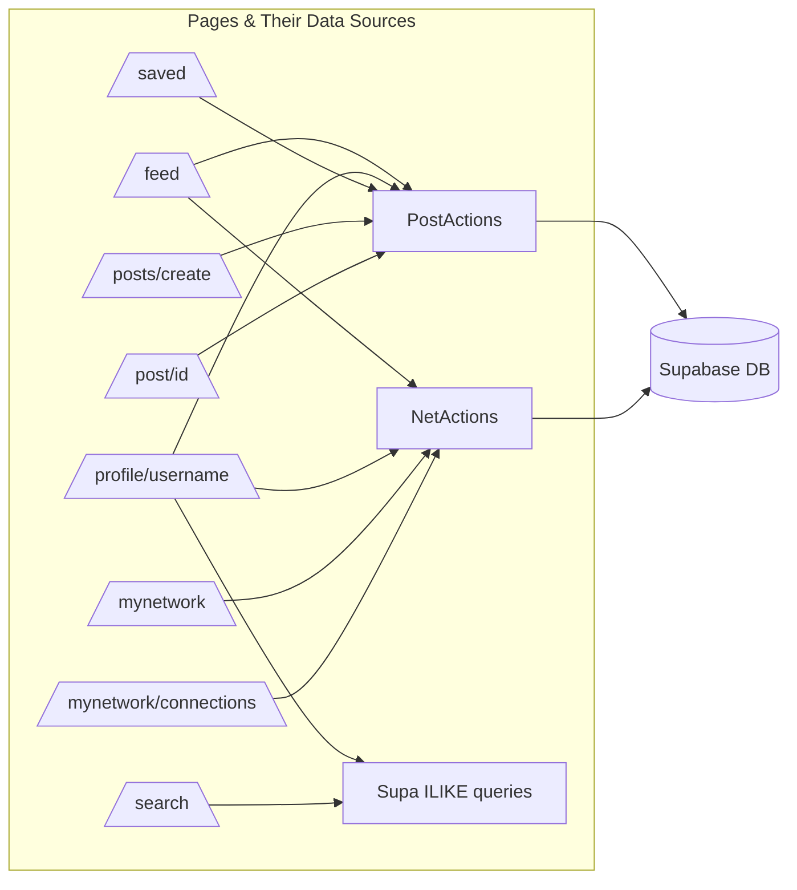
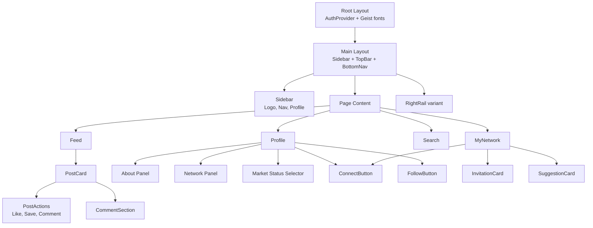
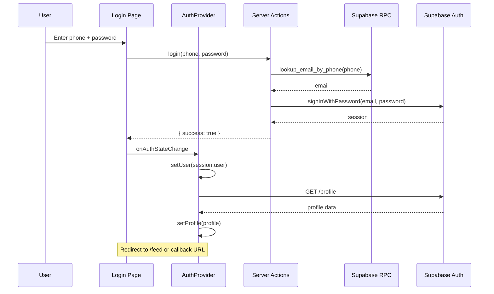

# Rice Agent — Architecture Diagram

## High-Level System Architecture

```mermaid
graph TB
    subgraph Client["Client Layer (Next.js 16)"]
        direction TB
        A[App Router]
        A --> AuthRoute["(auth) Route Group\n/login /register /forgot-password"]
        A --> MainRoute["(main) Route Group\n/feed /profile /search /posts /mynetwork ..."]
        MainRoute --> Layout[3-Column Layout]
        Layout --> Sidebar[Sidebar - 240px]
        Layout --> Content[Content - flex-1]
        Layout --> RightRail[RightRail - 260-300px]
    end

    subgraph State["State & Data Layer"]
        AuthCtx[AuthProvider Context\nSession + Profile]
        Hooks[Custom Hooks\nuse-search, use-regions,\nuse-connection, use-follow\nuse-subscription]
        Forms[react-hook-form + zod\nForm State]
    end

    subgraph Server["Server Layer"]
        SA[Server Actions\n\"use server\"]
        SA --> AuthActions[lib/auth/actions.ts\nlogin, register, updateProfile]
        SA --> PostActions[lib/posts/actions.ts\nCRUD posts, likes, saves, reports]
        SA --> NetActions[lib/network/actions.ts\nfollow, connect, suggestions]
        SA --> CommentActions[lib/comments/actions.ts\nCRUD comments]
        Proxy[proxy.ts\nMiddleware Surrogate]
    end

    subgraph Validation["Validation Layer"]
        Zod[Zod Schemas]
        Zod --> AuthVal[lib/validations/auth.ts]
        Zod --> PostVal[lib/validations/post.ts]
        Zod --> CommentVal[lib/validations/comment.ts]
    end

    subgraph Storage["Storage Layer"]
        Supa[Supabase]
        Supa --> DB[(PostgreSQL\n13 tables + 1 view)]
        Supa --> Auth[Auth\nPhone + Password]
        Supa --> SB[Storage\navatars, covers, post-images]
    end

    subgraph Shared["Shared"]
        Const[lib/constants.ts\nRoles, Types, Labels]
        Types[types/index.ts\nApp types extending DB types]
        DBTypes[lib/types/database.ts\nGenerated DB types]
        Utils[lib/utils.ts + format.ts]
        Sub[lib/subscription.ts\nlocalStorage mock]
    end

    Client --> State
    Client -->|fetch| Server
    Server --> Validation
    Server --> Storage
    Proxy --> Auth
    Hooks --> Supa
    Forms --> Zod
```

## Route Dependencies & Data Flow



## Component Hierarchy



## Auth Flow



## Server Action Pattern

```mermaid
flowchart TD
    Client[Client Component] -->|useActionState| Action["use server" function]
    Action --> requireAuth{requireAuth}
    requireAuth -->|unauthed| Return[return { success: false, error }]
    requireAuth -->|authed| Validate[Zod validation]
    Validate -->|invalid| ReturnError[return { success: false, error }]
    Validate -->|valid| SupaOp[Supabase operation]
    SupaOp -->|error| ReturnError
    SupaOp -->|success| Revalidate[revalidatePath / revalidateTag]
    Revalidate --> ReturnSuccess[return { success: true, data?, redirect? }]
    ReturnSuccess -->|redirect| Router[router.push / redirect]
```
