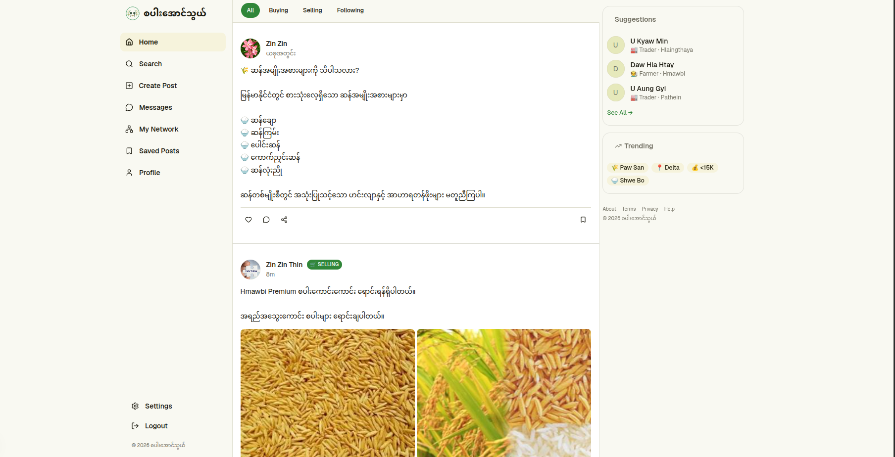
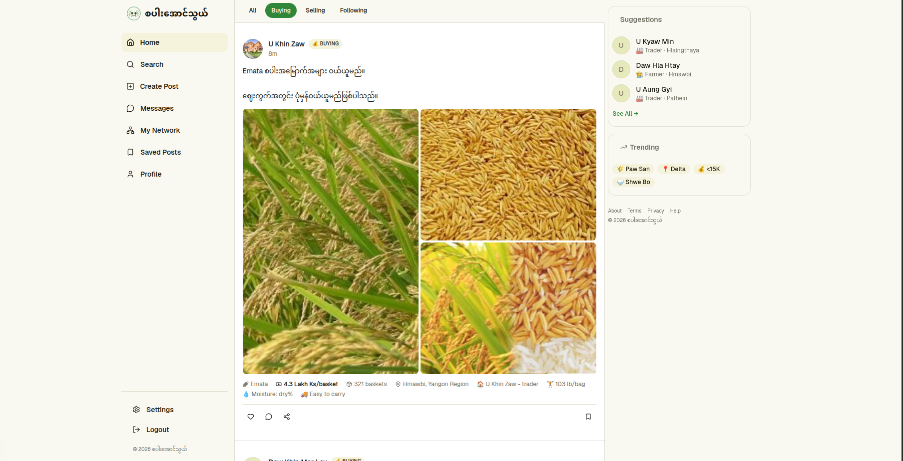
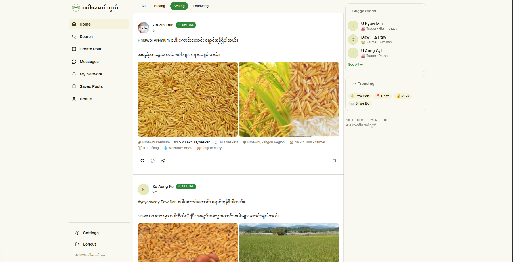
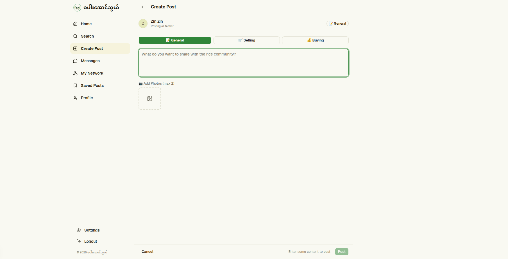
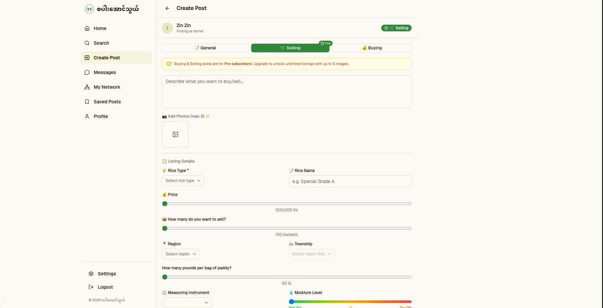
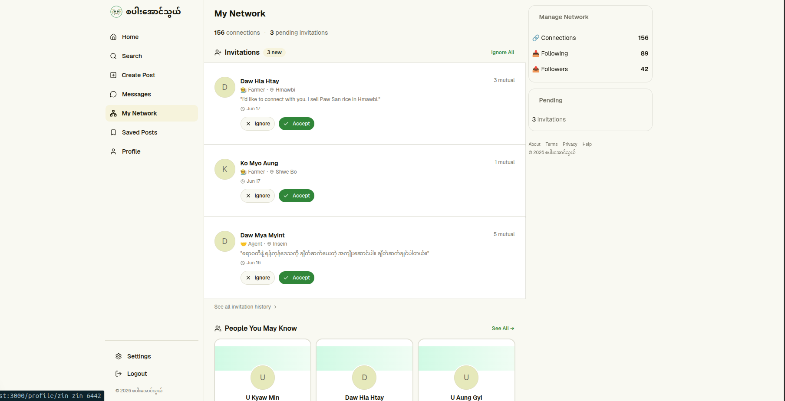
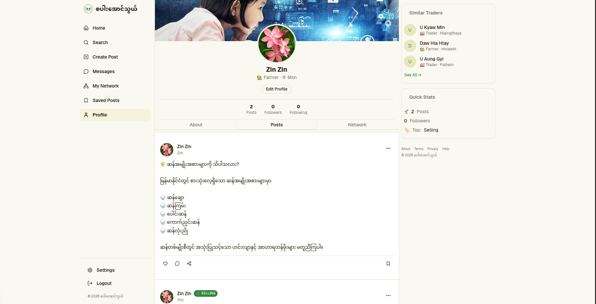

# စပါးအောင်သွယ် (Rice Agent)

A professional networking and marketplace platform for Myanmar's rice industry. Connects farmers, traders, agents, and users in a single platform where all user types can build professional profiles, publish buying and selling opportunities, follow industry participants, and discover trusted business connections.

🔗 **Live Demo**: [https://rice-agent.vercel.app/feed](https://rice-agent.vercel.app/feed)

---

## Screenshots

| Home Feed | Selling Post | Buying Post |
|-----------|--------------|-------------|
|  |  |  |

| Create Post | Create Selling and Buying Post |
|-------------|-------------------------------|
|  |  | 

| Network | Profile |
|---------|---------|
|  |  |

---

## Tech Stack

### Frontend
- [Next.js](https://nextjs.org/) - React framework
- [TypeScript](https://www.typescriptlang.org/) - Type safety
- [Tailwind CSS](https://tailwindcss.com/) - Styling
- [shadcn/ui](https://ui.shadcn.com/) - UI components

### Backend
- [Supabase Auth](https://supabase.com/auth) - Authentication
- [Supabase PostgreSQL](https://supabase.com/database) - Database
- [Supabase Storage](https://supabase.com/storage) - File storage

### Deployment
- [Vercel](https://vercel.com/) - Frontend hosting
- [Supabase](https://supabase.com/) - Backend services

---

## Features

### User Roles
- **Farmer** - Sell rice, find buyers
- **Trader** - Buy/sell rice, find suppliers
- **Agent** - Connect buyers and sellers
- **General User** - Browse and follow

### Core Features
- **Authentication** - Register, login, logout
- **Profiles** - Create and edit profiles with role, location, status
- **Posts** - Create buying/selling posts with images
- **Feed** - View latest posts and posts from followed users
- **Search** - Search users and posts with filters
- **Network** - Follow/unfollow users, view followers

---

## Getting Started

### Prerequisites
- Node.js 18+
- pnpm
- Supabase project

### Installation

```bash
# Clone the repository
git clone https://github.com/your-username/rice-agent.git
cd rice-agent

# Install dependencies
pnpm install

# Set up environment variables
cp .env.example .env.local
```

### Environment Variables

Add to `.env.local`:

```env
NEXT_PUBLIC_SUPABASE_URL=your-supabase-url
NEXT_PUBLIC_SUPABASE_ANON_KEY=your-anon-key
```

### Development

```bash
# Start development server
pnpm dev

# Build for production
pnpm build

# Start production server
pnpm start
```

## Project Structure

```
rice-agent/
├── src/
│   ├── app/              # Next.js app router
│   ├── components/       # React components
│   ├── lib/              # Utilities and Supabase client
│   └── hooks/            # Custom React hooks
├── public/
│   └── assets/
│       └── rices/        # Rice images for seeding
├── supabase/
│   ├── migrations/       # Database migrations
│   ├── seed.sql          # Township seed data
│   └── seed-posts.sql    # Posts seed data
├── scripts/
│   └── seed-posts.ts     # Seed script
└── docs/
    └── spec.md           # Project specification
```

---

## Contributing

1. Fork the repository
2. Create a feature branch
3. Commit your changes
4. Push to the branch
5. Create a Pull Request

---

## License

All Rights Reserved. See [LICENSE](LICENSE) for details.
