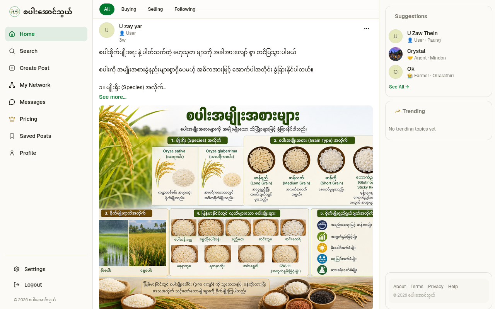
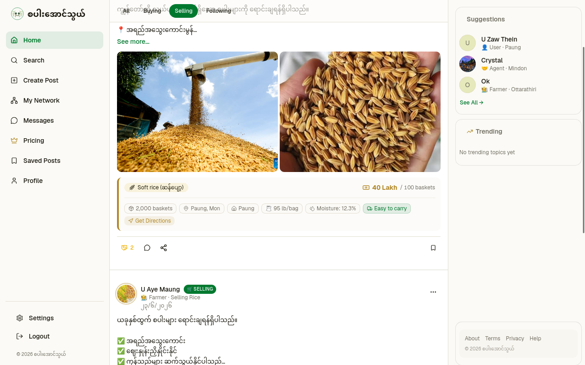
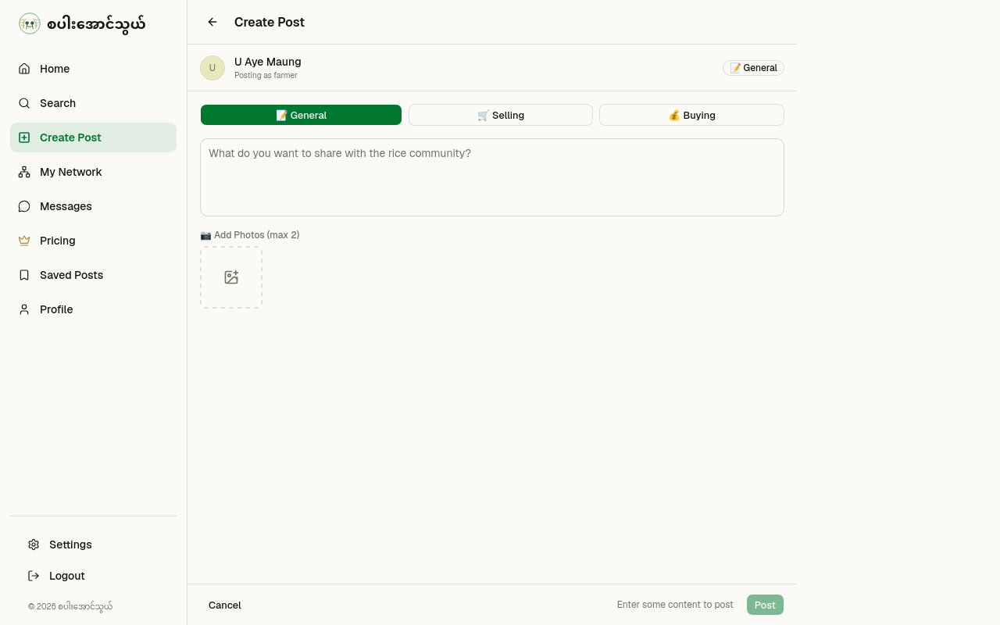
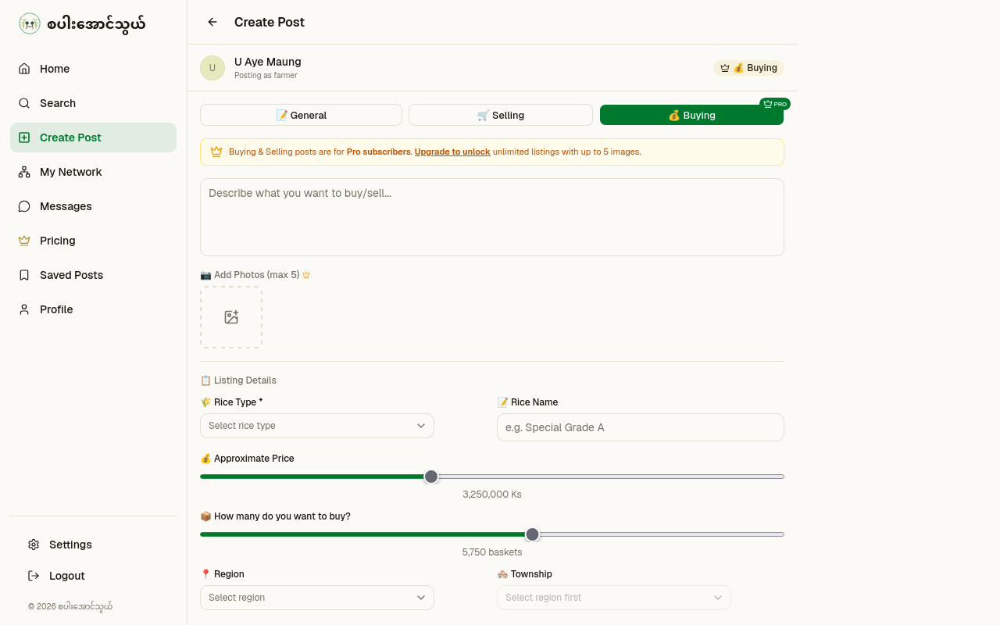
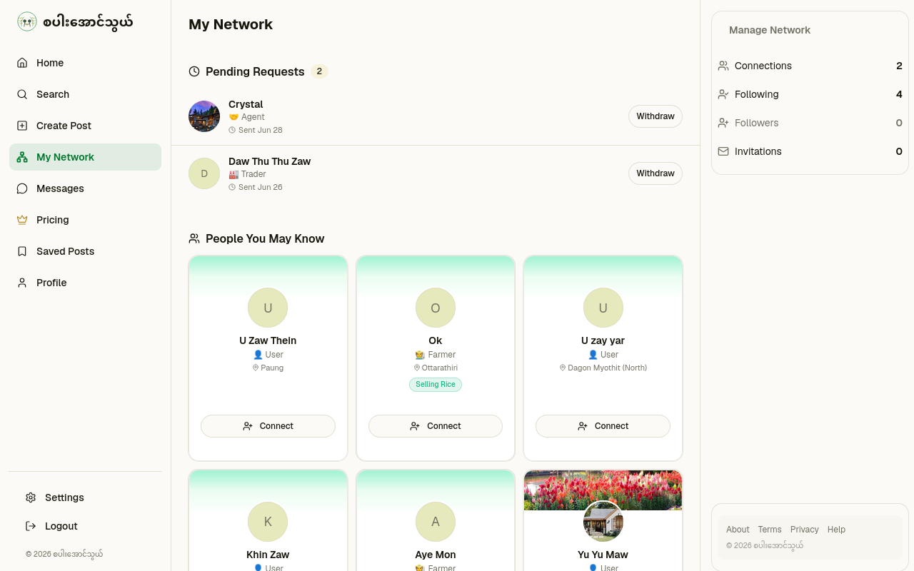
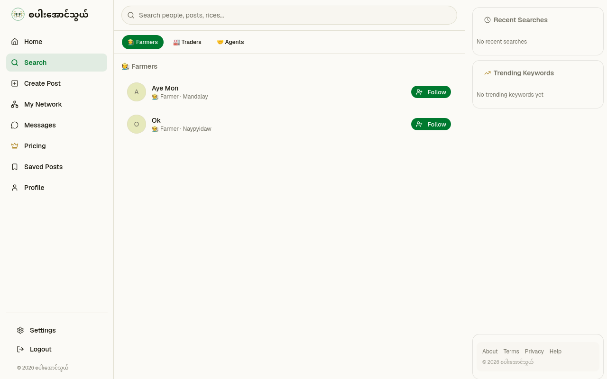
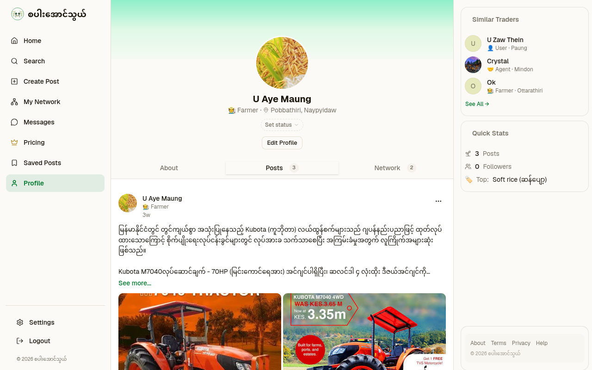
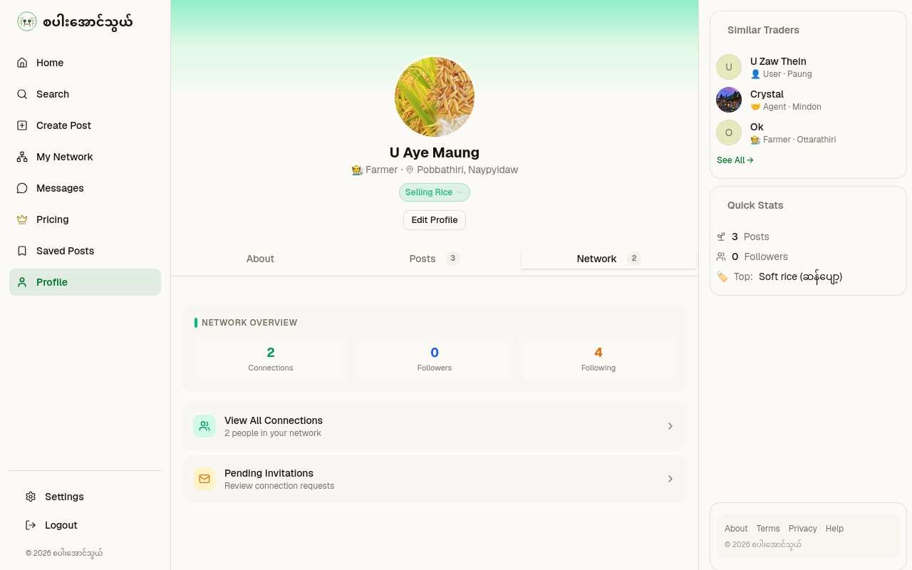
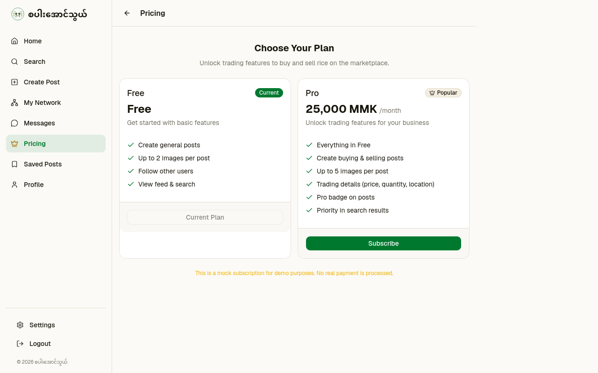
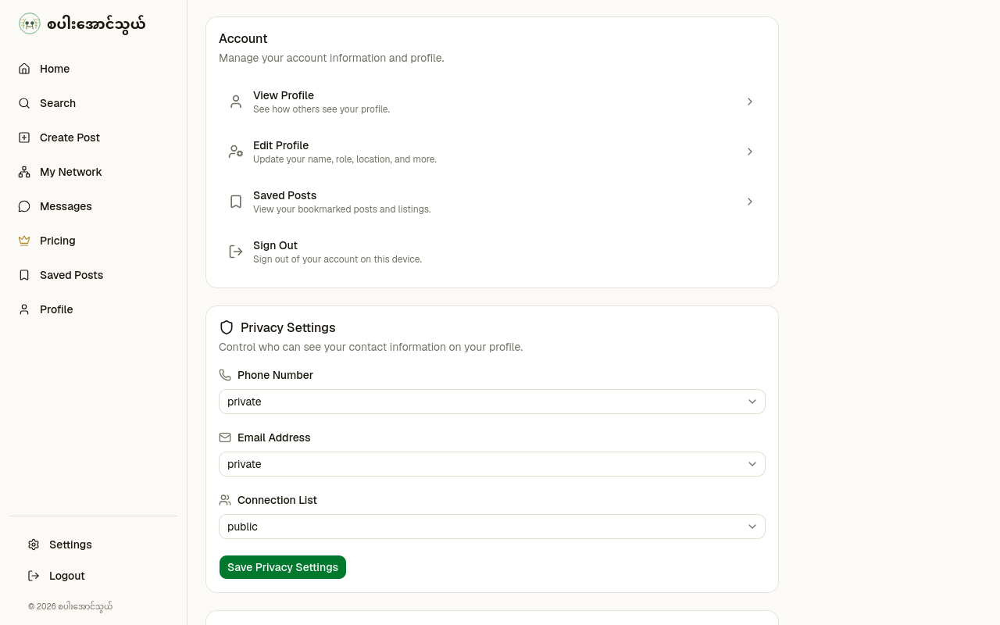

<!-- _class: cover -->

# စပါးအောင်သွယ်

## Myanmar's Rice Industry — Professional Networking & Marketplace

**Zin Zin Thin Zaw** . @6rose9

`#built-with-claude` `#vibecode.tours`

---

# What it is

- **Problem:** Myanmar rice trading relies on fragmented Facebook groups, phone calls, and personal contacts — discovery is slow, trust is hard to build
- **Who it's for:** Farmers, traders, agents, and general users in Myanmar's rice supply chain
- **What it does:** Build professional identity, publish buy/sell opportunities, grow your network

---

# How it works

1. **Register** with phone + password → choose your role (Farmer / Trader / Agent)
2. **Create profile** → photo, location, market status ("Selling Rice", "Available as Agent"…)
3. **Post opportunities** → buying or selling posts with rice type, price, images
4. **Discover & connect** → search by role, location, rice type; follow users; build your network

Stack: **Next.js 16 · React 19 · TypeScript · Tailwind CSS · shadcn/ui · Supabase** · built with Claude Code

---

<!-- _class: lead -->

## Screenshots

### Home Feed

---

### Filter Posts

---

### Create General Posts

---

### Create Rice Posts

---

### Network

---

### Search

---

### Profile

---

### Profile

---

### Pricing

---

### Setting

---

# Links

- **Live:** https://rice-agent.vercel.app/
- **Repo:** github.com/6rose9/rice-agent
- **License:** MIT
